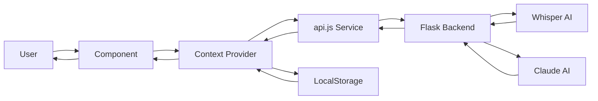

# 🎥 VidChat - YouTube Video Chat Assistant

A React-based web application that transforms YouTube videos into interactive chat experiences. Upload a video URL, get an AI-powered transcript, and have natural conversations about the content with full context memory and customizable AI personas.


---

## 📋 Table of Contents

- [Features](#-features)
- [Tech Stack](#-tech-stack)
- [Project Structure](#-project-structure)
- [Getting Started](#-getting-started)
- [Configuration](#-configuration)
- [Usage](#-usage)
- [Architecture](#-architecture)
- [API Integration](#-api-integration)
- [Development](#-development)
- [Troubleshooting](#-troubleshooting)
- [Contributing](#-contributing)
- [License](#-license)

---

## ✨ Features

### Core Functionality
- ✅ **YouTube Video Processing** - Automatic download and transcription using Whisper AI
- ✅ **AI-Powered Chat** - Natural conversations about video content with Claude
- ✅ **Context Memory** - Full conversation history maintained throughout the session
- ✅ **Transcript Viewer** - Side-by-side transcript display with copy functionality
- ✅ **Real-time Processing** - Live status updates during video processing
- ✅ **Persistent Cache** - LocalStorage-based caching for processed videos (5-item LRU)
- ✅ **Persona Library** - Save and switch between custom AI conversation styles

### User Experience
- 📱 **Fully Responsive** - Mobile-first design that works on all screen sizes
- 🎨 **Modern UI** - Beautiful gradient backgrounds with smooth animations
- ⚡ **Fast & Intuitive** - Clean interface with minimal learning curve
- 🔄 **Auto-scroll Chat** - Always shows the latest messages
- 💬 **Message History** - Clear chat memory while keeping video context
- 🎭 **Custom AI Personas** - Switch between personalities (Helpful, Pirate, Expert, etc.)
- ♿ **Accessibility First** - WCAG 2.1 AA compliant with keyboard navigation

### Technical Features
- 🔒 **Session Authentication** - Secure backend connection via hidden developer panel
- 🎯 **Input Validation** - Real-time URL and form validation
- 🛡️ **Error Handling** - Graceful error recovery with user-friendly messages
- 📊 **Transcript Stats** - Word count and reading time estimates
- 💾 **Smart Caching** - Persistent video transcripts with 5-item limit
- 🎨 **Markdown Support** - Rich text formatting in AI responses
- ♿ **WCAG Compliant** - Screen reader support, keyboard navigation, focus management

---

## 🛠️ Tech Stack

### Frontend
- **React 19.2** - Modern React with hooks and Context API
- **Vite 7.2** - Lightning-fast build tool
- **Tailwind CSS 3.4** - Utility-first CSS framework
- **Lucide React** - Beautiful icon library
- **React Markdown** - Markdown rendering with GFM support

### Development Tools
- **ESLint** - Code linting
- **PostCSS** - CSS processing
- **Autoprefixer** - Vendor prefix automation

### Backend (Separate Repository)
- **Flask** - Python web framework
- **OpenAI Whisper** - Audio transcription
- **Anthropic Claude** - Chat AI
- **yt-dlp** - YouTube video download

---

## 📁 Project Structure

```
vidchat/
├── public/                      # Static assets
├── src/
│   ├── components/              # React components
│   │   ├── AuthPanel.jsx        # Backend authentication UI
│   │   ├── ChatPanel.jsx        # Chat interface with persona library
│   │   ├── ConnectionStatus.jsx # Connection indicator
│   │   ├── ErrorBoundary.jsx    # Error isolation component
│   │   ├── MessageBubble.jsx    # Individual messages with markdown
│   │   ├── ProcessingIndicator.jsx # Loading state
│   │   ├── SettingsModal.jsx    # Settings & developer panel
│   │   ├── TranscriptPanel.jsx  # Transcript display
│   │   └── VideoInput.jsx       # YouTube URL input
│   │
│   ├── context/                 # React Context providers
│   │   ├── ChatContext.jsx      # Chat state management
│   │   └── VideoContext.jsx     # Video processing state
│   │
│   ├── hooks/                   # Custom React hooks (deprecated)
│   │   ├── useChat.js           # Legacy chat hook
│   │   └── useVideoChat.js      # Legacy video hook
│   │
│   ├── services/                # API & business logic
│   │   ├── api.js               # Backend API calls
│   │   └── videoService.js      # Video utilities
│   │
│   ├── utils/                   # Helper functions
│   │   └── validators.js        # Input validation
│   │
│   ├── App.jsx                  # Main app component
│   ├── main.jsx                 # React entry point
│   └── index.css                # Global styles + accessibility
│
├── index.html                   # HTML template
├── package.json                 # Dependencies
├── vite.config.js              # Vite configuration
├── tailwind.config.js          # Tailwind configuration
├── postcss.config.js           # PostCSS configuration
├── eslint.config.js            # ESLint rules
└── README.md                   # This file
```

---

## 🚀 Getting Started

### Prerequisites

- **Node.js** ≥ 20.19.0 or ≥ 22.12.0
- **npm** ≥ 8.0.0
- **Backend server** (Flask + Whisper + Claude)

### Installation

1. **Clone the repository**
   ```bash
   git clone <your-repo-url>
   cd vidchat
   ```

2. **Install dependencies**
   ```bash
   npm install
   ```

3. **Start development server**
   ```bash
   npm run dev
   ```

4. **Open in browser**
   ```
   http://localhost:5173
   ```

### Build for Production

```bash
# Create optimized build
npm run build

# Preview production build
npm run preview
```

---

## ⚙️ Configuration

### Backend Setup

The frontend requires a Flask backend server. Set up your backend with:

1. **Ngrok URL** - Tunnel to your local Flask server
   ```bash
   ngrok http 5000
   ```

2. **Colab Session Cookie** - For Google Colab hosting
   - Open your Colab notebook
   - Inspect → Application → Cookies
   - Copy session cookie value

### Environment Variables (Optional)

Create `.env` file for default backend URL:

```env
VITE_BACKEND_URL=https://your-ngrok-url.ngrok-free.app
VITE_BACKEND_COOKIE=your_session_cookie_here
```

Access in code:
```javascript
const defaultBackendUrl = import.meta.env.VITE_BACKEND_URL || '';
```

---

## 💻 Usage

### Step 1: Authentication (Developer Mode)
1. Click **Settings** icon (top-right corner)
2. Click **"Developer Options"** **5 times** to unlock
3. Enter your **Ngrok URL** (backend endpoint)
4. Paste your **Colab session cookie**
5. Click **Connect & Authenticate**

### Step 2: Process Video
1. Paste a **YouTube URL** (any format supported):
   - `youtube.com/watch?v=...`
   - `youtu.be/...`
   - `youtube.com/shorts/...`
2. Click **Start Analysis**
3. Wait 30-60 seconds for processing
4. **Cache hit** if you've processed this video before (instant load!)

### Step 3: Chat with Custom Personas
1. Ask questions about the video
2. Click **Settings icon** in chat header to open **Persona Library**
3. Type a custom persona (e.g., "Angry Mother", "Pirate", "Expert Professor")
4. Click **💾 Save** to add it to your library
5. Select saved personas to switch AI conversation style
6. View transcript on the left (desktop) or below (mobile)
7. Clear memory with **🗑️ trash icon** if needed
8. Copy transcript with **📋 copy button**

### Supported YouTube URL Formats
- Standard: `https://www.youtube.com/watch?v=dQw4w9WgXcQ`
- Short: `https://youtu.be/dQw4w9WgXcQ`
- Shorts: `https://www.youtube.com/shorts/dQw4w9WgXcQ`
- Embed: `https://www.youtube.com/embed/dQw4w9WgXcQ`

---

## 🗂️ Architecture

### Component Hierarchy

```
App
├── ErrorBoundary (wraps entire app)
├── SettingsModal (global settings)
├── Main Layout
    ├── ErrorBoundary (TranscriptPanel wrapper)
    │   └── TranscriptPanel
    │       └── Copy button
    └── ErrorBoundary (ChatPanel wrapper)
        └── ChatPanel
            ├── Persona Library (collapsible)
            ├── Header (with clear button)
            ├── MessageBubble[] (messages list)
            └── Input area (with send button)
```

### State Management Flow

```
User Action → Component → Context → Service → API → Backend
                ↓
         Update Context State
                ↓
           Re-render UI
```

### Context Architecture

```
VideoProvider (Video processing state)
  ↓
  ChatProvider (Chat messages & personas)
    ↓
    App Component Tree
```

### Data Persistence

```
LocalStorage Keys:
- yt_ai_chat_history          (5 most recent video transcripts)
- chat_history_{videoName}    (per-video chat history)
- chat_style_{videoName}      (per-video active persona)
- ai_style_library            (saved custom personas)
```

### Data Flow



---

## 📌 API Integration

### Endpoints

#### 1. Process Video
```javascript
POST /process_full_video
Content-Type: application/json

Request:
{
  "url": "https://youtube.com/watch?v=..."
}

Response:
{
  "video_name": "Video Title",
  "transcript": "Full transcript text..."
}
```

#### 2. Chat
```javascript
POST /chat
Content-Type: application/json

Request:
{
  "message": "User question",
  "transcript": "Full video transcript",
  "video_name": "Video Title",
  "history": [
    { "role": "user", "content": "Previous question" },
    { "role": "assistant", "content": "Previous answer" }
  ],
  "reply_style": "Helpful and concise" // NEW: AI persona
}

Response:
{
  "response": "AI answer"
}
```

### Error Handling

All API calls include comprehensive error handling:

```javascript
try {
  const data = await api.processVideo(backendUrl, videoUrl);
  // Success
} catch (error) {
  // User-friendly error message displayed
  console.error('Processing failed:', error.message);
}
```

---

## 🔧 Development

### Project Scripts

```bash
# Development server (hot reload)
npm run dev

# Production build
npm run build

# Preview production build
npm run preview

# Lint code
npm run lint
```

### Code Style Guidelines

- **Components**: PascalCase (e.g., `ChatPanel.jsx`)
- **Contexts**: PascalCase with "Context" suffix (e.g., `VideoContext.jsx`)
- **Hooks**: camelCase with `use` prefix (e.g., `useVideoChat.js`)
- **Services**: camelCase (e.g., `api.js`)
- **Constants**: UPPER_SNAKE_CASE

### Component Development Pattern

```javascript
// 1. Imports
import React, { useState } from 'react';
import { Icon } from 'lucide-react';
import { useVideoContext } from '../context/VideoContext';

// 2. Component definition with props destructuring
export default function ComponentName({ prop1, prop2 }) {
  // 3. Context consumption
  const { state, action } = useVideoContext();

  // 4. Local state declarations
  const [localState, setLocalState] = useState(initial);

  // 5. Event handlers
  const handleAction = () => {
    // Logic here
  };

  // 6. Render
  return (
    <div>
      {/* JSX */}
    </div>
  );
}
```

### Adding New Features

1. **Create component** in `src/components/`
2. **Add context** if global state needed in `src/context/`
3. **Add service** if API call needed in `src/services/`
4. **Add validation** in `src/utils/validators.js`
5. **Import in App.jsx** and wrap with ErrorBoundary

---

## 🛠 Troubleshooting

### Common Issues

#### 1. Styles Not Loading
```bash
# Clear cache and reinstall
rm -rf node_modules
npm install
npm run dev
```

#### 2. Tailwind Not Working
- Check `tailwind.config.js` exists in root
- Verify `@tailwind` directives in `index.css`
- Restart dev server

#### 3. Backend Connection Fails
- Verify Ngrok URL is correct and active
- Check session cookie is valid (not expired)
- Ensure backend server is running
- Click "Developer Options" 5 times to unlock settings

#### 4. Video Processing Timeout
- Video might be too long (>30 minutes)
- Backend server might be overloaded
- Check backend logs for errors
- Try a shorter video first

#### 5. Chat Not Responding
- Check browser console for errors
- Verify backend `/chat` endpoint is working
- Ensure transcript was loaded successfully
- Try clearing chat history

#### 6. Persona Not Saving
- Ensure persona name is at least 2 characters
- Don't use "Helpful and concise" (reserved default)
- Check LocalStorage isn't full (browser limit)

#### 7. Cache Not Working
- Check browser LocalStorage isn't disabled
- Clear cache manually: Dev Tools → Application → LocalStorage
- Verify `CACHE_KEY` constant in `VideoContext.jsx`

#### 8. Accessibility Issues
- Enable screen reader (NVDA, JAWS, VoiceOver)
- Test keyboard navigation (Tab, Enter, Escape)
- Check focus indicators are visible
- Verify ARIA labels in components

### Debug Mode

Enable console logging:
```javascript
// In api.js, uncomment:
console.log('Request:', payload);
console.log('Response:', data);

// In VideoContext.jsx, add:
console.log('Cache hit:', cached);
console.log('Saving to cache:', url);

// In ChatContext.jsx, add:
console.log('Sending message with style:', state.replyStyle);
```

### LocalStorage Inspection

```javascript
// Open browser console and run:

// View all cached videos
console.log(JSON.parse(localStorage.getItem('yt_ai_chat_history')));

// View chat history for specific video
console.log(JSON.parse(localStorage.getItem('chat_history_VideoName')));

// View saved personas
console.log(JSON.parse(localStorage.getItem('ai_style_library')));

// Clear all cache
localStorage.clear();
```

---

## 🎯 Feature Highlights

### 1. Persistent Video Cache
- **LRU Cache**: Stores last 5 processed videos
- **Instant Load**: Cache hits load transcript immediately
- **Smart Cleanup**: Automatically removes oldest entries
- **Storage Key**: `yt_ai_chat_history`

### 2. Persona Library
- **Custom Styles**: Save unlimited conversation personas
- **Per-Video Memory**: Each video remembers its active persona
- **Quick Switch**: One-click persona activation
- **Visual Indicators**: Green badge shows active persona
- **Storage Keys**: 
  - `ai_style_library` (global saved personas)
  - `chat_style_{videoName}` (per-video active persona)

### 3. Context Architecture
- **VideoContext**: Manages video processing, caching, authentication
- **ChatContext**: Manages messages, personas, chat history
- **Separation of Concerns**: Clean state isolation
- **Performance**: useReducer for complex state updates

### 4. Accessibility Features
- **Keyboard Navigation**: Full app navigable via keyboard
- **Screen Reader Support**: Comprehensive ARIA labels
- **Focus Management**: Clear focus indicators
- **Skip Links**: Jump to main content
- **Live Regions**: Dynamic content announcements
- **High Contrast**: Supports prefers-contrast media query
- **Reduced Motion**: Respects prefers-reduced-motion

---

## 📚 API Reference

### VideoContext API

```javascript
const {
  // State
  backendUrl,          // Backend API URL
  sessionCookie,       // Authentication cookie
  videoUrl,            // Current video URL
  transcript,          // Video transcript
  videoName,           // Video title
  loading,             // Processing state
  error,               // Error message
  stage,               // 'idle' | 'processing' | 'ready'
  
  // Actions
  setBackendUrl,       // Update backend URL
  setSessionCookie,    // Update session cookie
  setVideoUrl,         // Update video URL
  processVideo,        // Process video (with caching)
  resetVideo,          // Clear video state
} = useVideoContext();
```

### ChatContext API

```javascript
const {
  // State
  messages,            // Chat message array
  inputMessage,        // Current input text
  chatLoading,         // AI response loading
  replyStyle,          // Active AI persona
  messagesEndRef,      // Auto-scroll ref
  
  // Actions
  setInputMessage,     // Update input text
  setReplyStyle,       // Change AI persona
  sendMessage,         // Send chat message
  clearChat,           // Clear message history
  initializeChat,      // Initialize with system message
  resetChat,           // Complete chat reset
} = useChatContext();
```

---

## 🤝 Contributing

Contributions are welcome! Please follow these guidelines:

1. **Fork the repository**
2. **Create a feature branch** (`git checkout -b feature/AmazingFeature`)
3. **Follow code style guidelines** (see Development section)
4. **Add ErrorBoundary** around new components
5. **Test accessibility** (keyboard navigation, screen readers)
6. **Commit changes** (`git commit -m 'Add AmazingFeature'`)
7. **Push to branch** (`git push origin feature/AmazingFeature`)
8. **Open a Pull Request**

---

