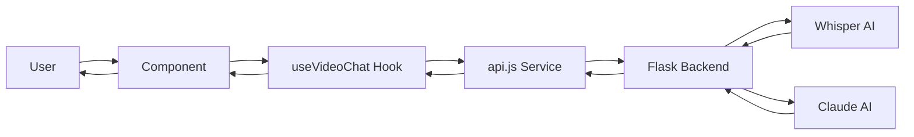

# 🎥 VidChat - YouTube Video Chat Assistant

A React-based web application that transforms YouTube videos into interactive chat experiences. Upload a video URL, get an AI-powered transcript, and have natural conversations about the content with full context memory.


---

## 📋 Table of Contents

- [Features](#-features)
- [Tech Stack](#-tech-stack)
- [Project Structure](#-project-structure)
- [Getting Started](#-getting-started)
- [Configuration](#-configuration)
- [Usage](#-usage)
- [Architecture](#-architecture)
- [API Integration](#-api-integration)
- [Development](#-development)
- [Troubleshooting](#-troubleshooting)
- [Contributing](#-contributing)
- [License](#-license)

---

## ✨ Features

### Core Functionality
- ✅ **YouTube Video Processing** - Automatic download and transcription using Whisper AI
- ✅ **AI-Powered Chat** - Natural conversations about video content with Claude
- ✅ **Context Memory** - Full conversation history maintained throughout the session
- ✅ **Transcript Viewer** - Side-by-side transcript display with copy functionality
- ✅ **Real-time Processing** - Live status updates during video processing

### User Experience
- 📱 **Fully Responsive** - Mobile-first design that works on all screen sizes
- 🎨 **Modern UI** - Beautiful gradient backgrounds with smooth animations
- ⚡ **Fast & Intuitive** - Clean interface with minimal learning curve
- 🔄 **Auto-scroll Chat** - Always shows the latest messages
- 💬 **Message History** - Clear chat memory while keeping video context

### Technical Features
- 🔒 **Session Authentication** - Secure backend connection via Colab cookies
- 🎯 **Input Validation** - Real-time URL and form validation
- 🛡️ **Error Handling** - Graceful error recovery with user-friendly messages
- 📊 **Transcript Stats** - Word count and reading time estimates

---

## 🛠️ Tech Stack

### Frontend
- **React 19.2** - Modern React with hooks
- **Vite 7.2** - Lightning-fast build tool
- **Tailwind CSS 3.4** - Utility-first CSS framework
- **Lucide React** - Beautiful icon library

### Development Tools
- **ESLint** - Code linting
- **PostCSS** - CSS processing
- **Autoprefixer** - Vendor prefix automation

### Backend (Separate Repository)
- **Flask** - Python web framework
- **OpenAI Whisper** - Audio transcription
- **Anthropic Claude** - Chat AI
- **yt-dlp** - YouTube video download

---

## 📁 Project Structure

```
vidchat/
├── public/                      # Static assets
├── src/
│   ├── components/              # React components
│   │   ├── AuthPanel.jsx        # Backend authentication UI
│   │   ├── ConnectionStatus.jsx # Connection indicator
│   │   ├── VideoInput.jsx       # YouTube URL input
│   │   ├── ProcessingIndicator.jsx # Loading state
│   │   ├── TranscriptPanel.jsx  # Transcript display
│   │   ├── ChatPanel.jsx        # Chat interface
│   │   └── MessageBubble.jsx    # Individual messages
│   │
│   ├── hooks/                   # Custom React hooks
│   │   ├── useVideoChat.js      # Video processing state
│   │   └── useChat.js           # Chat message management
│   │
│   ├── services/                # API & business logic
│   │   ├── api.js               # Backend API calls
│   │   └── videoService.js      # Video utilities
│   │
│   ├── utils/                   # Helper functions
│   │   └── validators.js        # Input validation
│   │
│   ├── App.jsx                  # Main app component
│   ├── main.jsx                 # React entry point
│   └── index.css                # Global styles
│
├── index.html                   # HTML template
├── package.json                 # Dependencies
├── vite.config.js              # Vite configuration
├── tailwind.config.js          # Tailwind configuration
├── postcss.config.js           # PostCSS configuration
├── eslint.config.js            # ESLint rules
└── README.md                   # This file
```

---

## 🚀 Getting Started

### Prerequisites

- **Node.js** ≥ 20.19.0 or ≥ 22.12.0
- **npm** ≥ 8.0.0
- **Backend server** (Flask + Whisper + Claude)

### Installation

1. **Clone the repository**
   ```bash
   git clone <your-repo-url>
   cd vidchat
   ```

2. **Install dependencies**
   ```bash
   npm install
   ```

3. **Start development server**
   ```bash
   npm run dev
   ```

4. **Open in browser**
   ```
   http://localhost:5173
   ```

### Build for Production

```bash
# Create optimized build
npm run build

# Preview production build
npm run preview
```

---

## ⚙️ Configuration

### Backend Setup

The frontend requires a Flask backend server. Set up your backend with:

1. **Ngrok URL** - Tunnel to your local Flask server
   ```bash
   ngrok http 5000
   ```

2. **Colab Session Cookie** - For Google Colab hosting
   - Open your Colab notebook
   - Inspect → Application → Cookies
   - Copy session cookie value

### Environment Variables (Optional)

Create `.env` file for default backend URL:

```env
VITE_BACKEND_URL=https://your-ngrok-url.ngrok-free.app
```

Access in code:
```javascript
const defaultBackendUrl = import.meta.env.VITE_BACKEND_URL || '';
```

---

## 💻 Usage

### Step 1: Authentication
1. Enter your **Ngrok URL** (backend endpoint)
2. Paste your **Colab session cookie**
3. Click **Connect & Authenticate**

### Step 2: Process Video
1. Paste a **YouTube URL** (any format supported):
   - `youtube.com/watch?v=...`
   - `youtu.be/...`
   - `youtube.com/shorts/...`
2. Click **Start Analysis**
3. Wait 30-60 seconds for processing

### Step 3: Chat
1. Ask questions about the video
2. View transcript on the left (desktop) or below (mobile)
3. Clear memory with trash icon if needed
4. Copy transcript with copy button

### Supported YouTube URL Formats
- Standard: `https://www.youtube.com/watch?v=dQw4w9WgXcQ`
- Short: `https://youtu.be/dQw4w9WgXcQ`
- Shorts: `https://www.youtube.com/shorts/dQw4w9WgXcQ`
- Embed: `https://www.youtube.com/embed/dQw4w9WgXcQ`

---

## 🏗️ Architecture

### Component Hierarchy

```
App
├── AuthPanel (when not authenticated)
├── ConnectionStatus (when authenticated)
├── VideoInput (idle stage)
├── ProcessingIndicator (processing stage)
└── Main Layout (ready stage)
    ├── TranscriptPanel
    │   └── Copy button
    └── ChatPanel
        ├── Header (with clear button)
        ├── MessageBubble[] (messages list)
        └── Input area (with send button)
```

### State Management Flow

```
User Action → Component → Hook → Service → API → Backend
                ↓
            Update State
                ↓
          Re-render UI
```

### Data Flow



---

## 🔌 API Integration

### Endpoints

#### 1. Process Video
```javascript
POST /process_full_video
Content-Type: application/json

Request:
{
  "url": "https://youtube.com/watch?v=..."
}

Response:
{
  "video_name": "Video Title",
  "transcript": "Full transcript text..."
}
```

#### 2. Chat
```javascript
POST /chat
Content-Type: application/json

Request:
{
  "message": "User question",
  "transcript": "Full video transcript",
  "video_name": "Video Title",
  "history": [
    { "role": "user", "content": "Previous question" },
    { "role": "assistant", "content": "Previous answer" }
  ]
}

Response:
{
  "response": "AI answer"
}
```

### Error Handling

All API calls include comprehensive error handling:

```javascript
try {
  const data = await api.processVideo(backendUrl, videoUrl);
  // Success
} catch (error) {
  // User-friendly error message displayed
  console.error('Processing failed:', error.message);
}
```

---

## 🔧 Development

### Project Scripts

```bash
# Development server (hot reload)
npm run dev

# Production build
npm run build

# Preview production build
npm run preview

# Lint code
npm run lint
```

### Code Style Guidelines

- **Components**: PascalCase (e.g., `ChatPanel.jsx`)
- **Hooks**: camelCase with `use` prefix (e.g., `useVideoChat.js`)
- **Services**: camelCase (e.g., `api.js`)
- **Constants**: UPPER_SNAKE_CASE

### Component Development Pattern

```javascript
// 1. Imports
import React, { useState } from 'react';
import { Icon } from 'lucide-react';

// 2. Component definition with props destructuring
export default function ComponentName({ prop1, prop2 }) {
  // 3. State declarations
  const [state, setState] = useState(initial);

  // 4. Event handlers
  const handleAction = () => {
    // Logic here
  };

  // 5. Render
  return (
    
      {/* JSX */}
    
  );
}
```

### Adding New Features

1. **Create component** in `src/components/`
2. **Add hook** if complex state needed in `src/hooks/`
3. **Add service** if API call needed in `src/services/`
4. **Add validation** in `src/utils/validators.js`
5. **Import in App.jsx**

---

## 🐛 Troubleshooting

### Common Issues

#### 1. Styles Not Loading
```bash
# Clear cache and reinstall
rm -rf node_modules
npm install
npm run dev
```

#### 2. Tailwind Not Working
- Check `tailwind.config.js` exists in root
- Verify `@tailwind` directives in `index.css`
- Restart dev server

#### 3. Backend Connection Fails
- Verify Ngrok URL is correct
- Check session cookie is valid
- Ensure backend server is running

#### 4. Video Processing Timeout
- Video might be too long (>30 minutes)
- Backend server might be overloaded
- Check backend logs for errors

#### 5. Chat Not Responding
- Check browser console for errors
- Verify backend `/chat` endpoint is working
- Ensure transcript was loaded successfully

### Debug Mode

Enable console logging:
```javascript
// In api.js, uncomment:
console.log('Request:', payload);
console.log('Response:', data);
```

---

